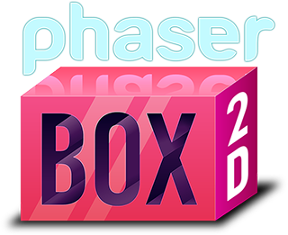

# Phaser Box2D



A high-performance, industry-standard 2D physics engine built on Box2D v3, delivering incredibly realistic and engaging web game experiences.

This repository contains the complete Phaser Box2D library, along with:

* A Getting Started Guide
* Phaser Box2D API Documentation 
* A Vite Phaser Box2D Project Template

See https://phaser.io/box2d for details about Phaser Box2D.

Need support? Join our Box2D channel in the [Phaser Discord](https://discord.gg/phaser).

## 50+ Free Box2D Source Code Examples

We've put together a comprehensive package of over 50 Phaser Box2D examples. These showcase all kinds of features, from complete mini-games to Phaser sprite integration. You can download these for free at https://phaser.io/account/downloads#box2d (requires free Phaser account)

## Why another Box2D port?

There are plenty of ports of Box2D to JavaScript, so why did we create another one? The main reason is because on August 12th 2024 Box2D version 3.0 was released. This is was a brand-new version and is the one that we converted. The others available are ports based on the old version 2.

Version 3 introduces several significant improvements that justify the upgrade. The new Soft Step Solver demonstrates markedly increased stability compared to version 2 — an improvement acknowledged by the Box2D author himself. Additional enhancements include superior precision, extensively redesigned joint mechanics, and the introduction of capsule-based physics bodies. Perhaps most significantly, the speculative collision system has been completely reconstructed, eliminating polygon gaps, minimizing performance impact, and adding Bullet physics support. The Continuous Collision Detection (CCD) implementation in version 3 is particularly refined. The lack of these substantial improvements in v2 warranted the conversion.

It was important to us that we kept our conversion of Box2D within JavaScript. Modern browser VMs are so incredibly powerful you can easily have thousands of bodies flying around your world. It also allows you to easily integrate it into any front-end bundler you like, takes up less than 70KB (min+gz), will run client-side or server-side and is easy for developers to contribute back to the source.

## Does this only work with Phaser?

No. This library is entirely standalone and runs self-contained on the client or server. We include helper functions for integration with the [Phaser game framework](https://phaser.io) and lots of examples demonstrating use, they are optional.

## Getting Started

There is an extensive Getting Started Guide.

You can find this in the `getting-started` folder. Please start here! There's lots of information and handy things to learn.

## npm

You can download Phaser Box2D from npm:

```bash
npm i phaser-box2d
```

https://www.npmjs.com/package/phaser-box2d

## How to run the API Docs

1. If you haven't already, run `npm install`.
2. Then `npm run docs` to launch the API Docs site server.
3. Open your browser to the URL given (usually http://localhost:8000)

## How to use the Vite Template

1. Copy the `PhaserBox2D.js`, `PhaserBox2D-Debug.js` and `PhaserBox2D-Debug.js.map` files into the `vite-template/src` folder.
2. If you haven't already, run `npm install` from within the `vite-template` folder. This will install both Vite and Phaser.
3. Use the following npm commands:
    - `npm run dev` - to run Vite in dev/watcher mode and open your browser to the URL given.
    - `npm run build` - to make Vite create a build of the app in the `dist` folder.
    - `npm run preview` - to test the `dist` build. Open your browser to the URL given.
4. Open the `src/main.js` file to see Phaser and Box2D being used together in a simple example.
5. By default, the code uses the Release version of Box2D. If you would like to use the Debug version so you can use the Debug Draw renderer then simply edit the `import` statement in the `main.js` file to import `PhaserBox2D-Debug.js` instead of `PhaserBox2D.js`. Just remember to swap this back before doing a production build.

## License

The Phaser Box2D library includes code that is:

Copyright 2023 Erin Catto, released under the MIT license.  
Copyright 2025 Phaser Studio Inc, released under the MIT license.  

The Getting Started Guide, Examples and API Documentation are Copyright 2025 Phaser Studio Inc and are not for commercial use or distribution.

## Conversion Notes

This JavaScript version is a direct conversion of the C functions, so most of the [documentation](https://box2d.org/documentation) is the same.

The most common difference is that all C language typedef structs (e.g. b2Vec2) have been turned into JS classes.

In C they might use:

```c
bodyDef.position = (b2Vec2){0.0f, 4.0f};
```

In JS we must use:

```js
bodyDef.position = new b2Vec2(0.0, 4.0);
```

### World

A box 2D world (b2World) is a scene in which all simulation takes place.

You can create many box 2D worlds and simulate them at different rates with separate contents. They cannot interact with each other.

```js
// create a definition for a world using the default values
let worldDef = b2DefaultWorldDef();

// change some of the default values
worldDef.gravity = new b2Vec2(0, -10);

// create a world object and save the ID which will access it
let worldId = b2CreateWorld(worldDef);
```

### Bodies

A world contains bodies, which are simulated 2D objects.
The code is almost identical to the world creation.

```js
// create a definition for a body using the default values
let bodyDef = b2DefaultBodyDef();

// change some of the default values
bodyDef.type = b2BodyType.b2_dynamicBody;
bodyDef.position = new b2Vec2(0, 4);

// create the body
let bodyId = b2CreateBody(worldId, bodyDef);
```

### Shapes

Bodies require shapes which carry information about the materials.
The code should be familiar!

```js
// create a definition for a shape using the default values
let shapeDef = b2DefaultShapeDef();

// change some of the default values
shapeDef.density = 1.0;
shapeDef.friction = 0.3;
```

### Polygons

We cannot create the shape yet though, we need an outline first.

```js
// create a polygon shape using a helper function (NOTE: the parameters are half-width and half-height)
let box = b2MakeBox(1.0, 1.0);

// now we can create the shape, for the body, with the polygon
b2CreatePolygonShape(bodyId, shapeDef, box);
```

We have created a 2 x 2 box, made of material with density 1.0 and friction 0.3. It is at position 0, 4.
The polygon, circle, capsule, segment, or line creation will automatically add the body to the world.

Our world has a gravity acceleration of 10m/s/s downwards (close to the Earth's 9.8m/s/s), so this box will fall accordingly.

### Wrappers

For the JS conversion we have supplied some wrapper functions to help with common tasks.

The code above becomes:

```js
let world = CreateWorld({ worldDef: b2DefaultWorldDef() });

let box = CreateBoxPolygon({
    worldId: world.worldId,
    bodyDef: b2DefaultBodyDef(),
    type: b2BodyType.b2_dynamicBody,
    position: new b2Vec2(0, 4),
    size: 1,
    density: 1.0,
    friction: 0.3
});
```

Each wrapper has an associated configuration object, which should integrate with your editor to provide auto-complete assistance.

If the auto-complete is not working, you can find all of these block headers in the file `src/physics.js` along with the code for the wrapper functions.

```js
/**
 * @typedef {Object} BoxPolygonConfig
 * @property {b2WorldId} worldId - ID for the world in which to create the box.
 * @property {b2BodyDef} [bodyDef] - Body definition for the box.
 * @property {number} [type] - Type of the body (static, dynamic, kinematic).
 * @property {b2Vec2} [position] - Position of the box's center.
 * @property {b2BodyId} [bodyId] - Existing body ID if adding as a fixture.
 * @property {b2ShapeDef} [shapeDef] - Shape definition for the box.
 * @property {number} [density] - Density of the box.
 * @property {number} [friction] - Friction of the box.
 * @property {any} [color] - Custom color for the box.
 * @property {b2Vec2|number} size - Size of the box (either a b2Vec2 or a single number for square).
 */
```

### Static Objects

A static body is immobile in the world. It will be collided with according to the same rules as other bodies, but it will not move in reaction to any force.

Static bodies are often used for the ground, platforms, walls, etc.

To create a static object we follow the same procedure but specify `b2BodyType.b2_staticBody` instead of `b2BodyType.b2_dynamicBody` for the 'type' parameter.

### Running the Simulation

It is necessary to call b2WorldStep frequently to perform all of the calculations and advance the simulation by one time step.

Box2D is most stable when it is called with a fixed time step (one which does not vary depending on the speed of your machine, or the amount of work which it is doing).

There is some common code we use to make sure that the fixed time step and the real time elapsed are approximately in sync. We have wrapped this code in the function WorldStep().

Notes: The fixedTimeStep defaults to 60fps (1/60), and subStepCount defaults to 4 if they are not specified. These are good values for most uses.

```js
// step the physics simulation to advance it; Here we're using a fixed step of 30fps with two sub-steps per full step
const stepTime = WorldStep({ worldId: worldId, deltaTime: deltaTime, fixedTimeStep: 1/30, subStepCount: 2 });
```

### The End of the World

As the official Box2D documentation says: "When you are done with the simulation, you should destroy the world".

```js
b2DestroyWorld(worldId);
```

### The Whole Wrapper

All functions and type comments are in the file `physics.js`.

Each function is exported and can be imported with (e.g.):

```js
import { CreateWorld } from 'physics.js';
```


```js
/**
 * @typedef {Object} WorldConfig
 * @property {b2WorldDef} [worldDef] - World definition
 */

/**
 * Creates a world and returns the ID.
 * @param {WorldConfig} data - Configuration for the world.
 * @returns {{worldId: b2WorldId}} The created world's ID.
 */
export function CreateWorld(data)

/**
 * @typedef {Object} WorldStepConfig
 * @property {b2WorldId} worldId - The world ID value
 * @property {number} deltaTime - How long has it been since the last call (e.g. the value passed to a RAF update)
 * @property {number} [fixedTimeStep = 1/60] - Duration of the fixed timestep for the Physics simulation
 * @property {number} [subStepCount = 4] - Number of sub-steps performed per world step
 */

/**
 * Steps a physics world to match fixedTimeStep.
 * Returns the average time spent in the step function.
 * @param {WorldConfig} data - Configuration for the world.
 * @returns {number} totalTime - Time spent processing the step function, in seconds.
 */
export function WorldStep(data)

/**
 * @typedef {Object} CircleConfig
 * @property {b2WorldId} worldId - ID for the world in which to create the circle.
 * @property {b2BodyDef} [bodyDef] - Body definition for the circle.
 * @property {number} [type] - Type of the body (static, dynamic, kinematic).
 * @property {b2Vec2} [position] - Position of the circle's center.
 * @property {b2BodyId} [bodyId] - Existing body ID if adding as a fixture.
 * @property {b2ShapeDef} [shapeDef] - Shape definition for the circle.
 * @property {number} [density] - Density of the circle.
 * @property {number} [friction] - Friction of the circle.
 * @property {any} [color] - Custom color for the circle.
 * @property {number} [radius] - Radius of the circle.
 * @property {b2Vec2} [offset] - Offset of the circle's center when adding as a fixture.
 */

/**
 * Creates a circle shape and attaches it to a body.
 * @param {CircleConfig} data - Configuration for the circle.
 * @returns {{bodyId: b2BodyId, shapeId: b2ShapeId, object: b2Circle}} The created circle's body ID, shape ID, and object.
 */
export function CreateCircle(data)

/**
 * @typedef {Object} CapsuleConfig
 * @property {b2WorldId} worldId - ID for the world in which to create the capsule.
 * @property {b2BodyDef} [bodyDef] - Body definition for the capsule.
 * @property {number} [type] - Type of the body (static, dynamic, kinematic).
 * @property {b2Vec2} [position] - Position of the capsule's center.
 * @property {b2BodyId} [bodyId] - Existing body ID if adding as a fixture.
 * @property {b2ShapeDef} [shapeDef] - Shape definition for the capsule.
 * @property {number} [density] - Density of the capsule.
 * @property {number} [friction] - Friction of the capsule.
 * @property {number} [groupIndex] - Collision group index for the capsule.
 * @property {any} [color] - Custom color for the capsule.
 * @property {b2Vec2} [center1] - Center of the first circle of the capsule.
 * @property {b2Vec2} [center2] - Center of the second circle of the capsule.
 * @property {number} [radius] - Radius of the capsule's circles.
 */

/**
 * Creates a capsule shape and attaches it to a body.
 * @param {CapsuleConfig} data - Configuration for the capsule.
 * @returns {{bodyId: b2BodyId, shapeId: b2ShapeId, object: b2Capsule}} The created capsule's body ID, shape ID, and object.
 */
export function CreateCapsule(data)

/**
 * @typedef {Object} BoxPolygonConfig
 * @property {b2WorldId} worldId - ID for the world in which to create the box.
 * @property {b2BodyDef} [bodyDef] - Body definition for the box.
 * @property {number} [type] - Type of the body (static, dynamic, kinematic).
 * @property {b2Vec2} [position] - Position of the box's center.
 * @property {b2BodyId} [bodyId] - Existing body ID if adding as a fixture.
 * @property {b2ShapeDef} [shapeDef] - Shape definition for the box.
 * @property {number} [density] - Density of the box.
 * @property {number} [friction] - Friction of the box.
 * @property {any} [color] - Custom color for the box.
 * @property {b2Vec2|number} size - Size of the box (either a b2Vec2 or a single number for square).
 */

/**
 * Creates a box-shaped polygon and attaches it to a body.
 * @param {BoxPolygonConfig} data - Configuration for the box polygon.
 * @returns {{bodyId: b2BodyId, shapeId: b2ShapeId, object: b2Polygon}} The created box's body ID, shape ID, and object.
 */
export function CreateBoxPolygon(data)

/**
 * @typedef {Object} RevoluteJointConfig
 * @property {b2WorldId} worldId - ID for the world in which the bodies and joint exist.
 * @property {b2RevoluteJointDef} [jointDef] - A pre-existing b2RevoluteJointDef.
 * @property {b2BodyId} bodyIdA - The first body to connect with this joint.
 * @property {b2BodyId} bodyIdB - The second body to connect with this joint.
 * @property {b2Vec2} [anchorA] - Local position of the anchor point on the first body.
 * @property {b2Vec2} [anchorB] - Local position of the anchor point on the second body.
 * @property {number} [lowerAngle] - Lower limit of the joint's angle.
 * @property {number} [upperAngle] - Upper limit of the joint's angle.
 * @property {boolean} [enableLimit] - Whether to enable angle limits.
 * @property {boolean} [enableMotor] - Whether to enable the joint's motor.
 * @property {number} [motorSpeed] - The desired motor speed.
 * @property {number} [maxMotorTorque] - The maximum torque the motor can apply.
 * @property {boolean} [enableSpring] - Whether to enable the joint's spring.
 * @property {number} [hertz] - The frequency of the joint's spring.
 * @property {number} [dampingRatio] - The damping ratio of the joint's spring.
 * @property {boolean} [collideConnected] - Whether the connected bodies should collide.
 * @property {number} [drawSize] - The size to use when drawing the joint.
 */

/**
 * Creates a revolute joint between two bodies.
 * @param {RevoluteJointConfig} data - Configuration for the revolute joint.
 * @returns {{jointId: b2JointId}} The ID of the created revolute joint.
 */
export function CreateRevoluteJoint(data)

/**
 * @typedef {Object} WeldJointConfig
 * @property {b2WorldId} worldId - ID for the world in which the bodies and joint exist.
 * @property {b2WeldJointDef} [jointDef] - A pre-existing b2WeldJointDef.
 * @property {b2BodyId} bodyIdA - The first body to weld with this joint.
 * @property {b2BodyId} bodyIdB - The second body to weld with this joint.
 * @property {b2Vec2} [anchorA] - Local position of the anchor point on the first body.
 * @property {b2Vec2} [anchorB] - Local position of the anchor point on the second body.
 * @property {number} [hertz] - The frequency at which the weld joint is enforced.
 * @property {number} [dampingRatio] - The angular damping ratio when the weld joint is springing back into alignment.
 * @property {number} [referenceAngle] - Reference angle for the weld joint at rest.
 * @property {boolean} [collideConnected] - Whether the connected bodies should collide.
 */

/**
 * Creates a weld joint between two bodies.
 * @param {WeldJointConfig} data - Configuration for the weld joint.
 * @returns {{jointId: b2JointId}} The ID of the created weld joint.
 */
export function CreateWeldJoint(data)

/**
 * @typedef {Object} DistanceJointConfig
 * @property {b2WorldId} worldId - ID for the world in which the bodies and joint exist.
 * @property {b2DistanceJointDef} [jointDef] - A pre-existing b2DistanceJointDef.
 * @property {b2BodyId} bodyIdA - The first body to connect with this joint.
 * @property {b2BodyId} bodyIdB - The second body to connect with this joint.
 * @property {b2Vec2} [anchorA] - Local position of the anchor point on the first body.
 * @property {b2Vec2} [anchorB] - Local position of the anchor point on the second body.
 * @property {number} [length] - The natural length of the joint.
 * @property {number} [minLength] - The minimum allowed length of the joint.
 * @property {number} [maxLength] - The maximum allowed length of the joint.
 * @property {boolean} [enableSpring] - Whether to enable the joint's spring.
 * @property {number} [hertz] - The frequency of the joint's spring.
 * @property {number} [dampingRatio] - The damping ratio of the joint's spring.
 * @property {boolean} [enableLimit] - Whether to enable length limits.
 * @property {boolean} [collideConnected] - Whether the connected bodies should collide.
 */

/**
 * Creates a distance joint between two bodies.
 * @param {DistanceJointConfig} data - Configuration for the distance joint.
 * @returns {{jointId: b2JointId}} The ID of the created distance joint.
 */
export function CreateDistanceJoint(data)

/**
 * @typedef {Object} WheelJointConfig
 * @property {b2WorldId} worldId - ID for the world in which the bodies and joint exist.
 * @property {b2WheelJointDef} [jointDef] - A pre-existing b2WheelJointDef.
 * @property {b2BodyId} bodyIdA - The first body to connect with this joint.
 * @property {b2BodyId} bodyIdB - The second body to connect with this joint.
 * @property {b2Vec2} [anchorA] - Local position of the anchor point on the first body.
 * @property {b2Vec2} [anchorB] - Local position of the anchor point on the second body.
 * @property {boolean} [enableSpring] - Whether to enable the joint's spring.
 * @property {b2Vec2} [axis] - The local axis for the joint movement on body A.
 * @property {number} [hertz] - The frequency of the joint's spring.
 * @property {number} [dampingRatio] - The damping ratio of the joint's spring.
 * @property {boolean} [enableLimit] - Whether to enable translation limits.
 * @property {number} [lowerTranslation] - The lower translation limit.
 * @property {number} [upperTranslation] - The upper translation limit.
 * @property {boolean} [enableMotor] - Whether to enable the joint's motor.
 * @property {number} [maxMotorTorque] - The maximum torque the motor can apply.
 * @property {number} [motorSpeed] - The desired motor speed.
 * @property {boolean} [collideConnected] - Whether the connected bodies should collide.
 */

/**
 * Creates a wheel joint between two bodies.
 * @param {WheelJointConfig} data - Configuration for the wheel joint.
 * @returns {{jointId: b2JointId}} The ID of the created wheel joint.
 */
export function CreateWheelJoint(data)

/**
 * @typedef {Object} PrismaticJointConfig
 * @property {b2WorldId} worldId - ID for the world in which the bodies and joint exist.
 * @property {b2PrismaticJointDef} [jointDef] - A pre-existing b2PrismaticJointDef.
 * @property {b2BodyId} bodyIdA - The first body to connect with this joint.
 * @property {b2BodyId} bodyIdB - The second body to connect with this joint.
 * @property {b2Vec2} [anchorA] - Local position of the anchor point on the first body.
 * @property {b2Vec2} [anchorB] - Local position of the anchor point on the second body.
 * @property {b2Vec2} [axis] - The local axis for the joint movement on body A.
 * @property {number} [referenceAngle] - The reference angle between the bodies.
 * @property {boolean} [enableSpring] - Whether to enable the joint's spring.
 * @property {number} [hertz] - The frequency of the joint's spring.
 * @property {number} [dampingRatio] - The damping ratio of the joint's spring.
 * @property {boolean} [enableLimit] - Whether to enable translation limits.
 * @property {number} [lowerTranslation] - The lower translation limit.
 * @property {number} [upperTranslation] - The upper translation limit.
 * @property {boolean} [enableMotor] - Whether to enable the joint's motor.
 * @property {number} [maxMotorForce] - The maximum force the motor can apply.
 * @property {number} [motorSpeed] - The desired motor speed.
 * @property {boolean} [collideConnected] - Whether the connected bodies should collide.
 */

/**
 * Creates a prismatic joint between two bodies.
 * @param {PrismaticJointConfig} data - Configuration for the prismatic joint.
 * @returns {{jointId: b2JointId}} The ID of the created prismatic joint.
 */
export function CreatePrismaticJoint(data)

/**
 * @typedef {Object} MotorJointConfig
 * @property {b2WorldId} worldId - ID for the world in which the bodies and joint exist.
 * @property {b2MotorJointDef} [jointDef] - A pre-existing b2MotorJointDef.
 * @property {b2BodyId} bodyIdA - The first body to connect with this joint.
 * @property {b2BodyId} bodyIdB - The second body to connect with this joint.
 * @property {b2Vec2} [linearOffset] - The desired linear offset in frame A.
 * @property {number} [maxForce] - The maximum force that can be applied to reach the target offsets.
 * @property {number} [angularOffset] - The desired angular offset.
 * @property {number} [maxTorque] - The maximum torque that can be applied to reach the target angular offset.
 * @property {number} [correctionFactor] - Position correction factor in the range [0,1].
 * @property {boolean} [collideConnected] - Whether the connected bodies should collide.
 */

// NOTES about Motor Joints
// when 'correctionFactor' == 0.0 the body will not move
// if linking to the ground, 'bodyA' should be the ground body or the motion will be wrong
// 'linearOffset' is the world destination, not an offset from the starting position
/**
 * Creates a motor joint between two bodies.
 * @param {MotorJointConfig} data - Configuration for the motor joint.
 * @returns {{jointId: b2JointId}} The ID of the created motor joint.
 */
export function CreateMotorJoint(data)

/**
 * @typedef {Object} MouseJointConfig
 * @property {b2WorldId} worldId - ID for the world in which the bodies and joint exist.
 * @property {b2MouseJointDef} [jointDef] - A pre-existing b2MouseJointDef.
 * @property {b2BodyId} bodyIdA - The first (usually static) body to connect with this joint.
 * @property {b2BodyId} bodyIdB - The second (usually dynamic) body to connect with this joint.
 * @property {b2Vec2} [target] - The initial world target point.
 * @property {number} [hertz] - The response frequency.
 * @property {number} [dampingRatio] - The damping ratio.
 * @property {number} [maxForce] - The maximum force that can be exerted to reach the target point.
 * @property {boolean} [collideConnected] - Whether the connected bodies should collide.
 * e.g. worldId:worldId, bodyIdA:mouseCircle.bodyId, bodyIdB:mouseBox.bodyId, target:new b2Vec2(0, 0), hertz:30.0, dampingRatio:0.999, maxForce:35000
 */

/**
 * Creates a mouse joint between two bodies.
 * @param {MouseJointConfig} data - Configuration for the mouse joint.
 * @returns {{jointId: b2JointId}} The ID of the created mouse joint.
 */
export function CreateMouseJoint(data)
```

### Debug Drawing

This library is not attached to any particular drawing library or game framework.

For testing we have converted the Box2D C debug drawing library to draw into a browser canvas.

You'll need to set up an HTML page with a canvas; Here is a simple 'index.html':

```html
<!DOCTYPE html>
<html lang="en">
<head>
    <meta charset="UTF-8">
    <meta name="viewport" content="width=device-width, initial-scale=1.0">
    <title>Box 2D 3.0 JS</title>
    <style>
        body, html {
            margin: 0;
            padding: 0;
            overflow: hidden;
            height: 100%;
        }
        #canvas-container {
            position: fixed;
            top: 0;
            left: 0;
            right: 0;
            bottom: 0;
        }
        canvas {
            background-color: #0a0a0a;
            width: 100%;
            height: 100%;
        }
    </style>
</head>
<body>
    <div id="canvas-container">
        <canvas id="myCanvas"></canvas>
    </div>
    <script type="module" src="./main.js"></script>
    <script>
        function resizeCanvas() {
            const canvas = document.getElementById('myCanvas');
            const container = document.getElementById('canvas-container');
            canvas.width = container.clientWidth;
            canvas.height = container.clientHeight;
        }

        window.addEventListener('resize', resizeCanvas);
        window.addEventListener('load', resizeCanvas);
    </script>
</body>
</html>
```

You may have noticed that we're referencing a single JS file "main.js", this is where your test functions will go.

In your test JS file, you'll need to import debug_draw.js (which is where all the Canvas debug drawing functions are kept).

To set up debug drawing (do this before your RAF starts):

```js
// set the scale at which you want the world to be drawn
const m_drawScale = 7.0;

// get the canvas element from the web page
const canvas = document.getElementById('myCanvas');
const ctx = canvas.getContext('2d');

// create the debug drawing system
const m_draw = CreateDebugDraw(canvas, ctx, m_drawScale);
```

To update the debug drawing contents (do this inside your RAF update to see everything animate):

```js
// clear the canvas before redrawing it with updated physics objects
ctx.clearRect(0, 0, canvas.width, canvas.height);

// redraw the canvas with the bodies in the world
b2World_Draw(worldId, m_draw);
```

### A Complete Example

You can download this and over 50 more examples [from here](https://phaser.io/account/downloads#box2d)

File structure:

- /root (e.g. 'examples')
  - /lib
  - /your_project_name
    - index.html
    - main.js

#### main.js

```js
// Import Library Functions

import { CreateBoxPolygon, CreateCircle, CreateWorld, WorldStep } from '../lib/PhaserBox2D.js';
import { CreateDebugDraw, RAF } from '../lib/PhaserBox2D.js';
import { b2BodyType, b2DefaultBodyDef, b2DefaultWorldDef, b2HexColor } from '../lib/PhaserBox2D.js';
import { b2Rot, b2Vec2 } from '../lib/PhaserBox2D.js';

import { b2World_Draw } from '../lib/PhaserBox2D.js';

// ** Debug Drawing **

// set the scale at which you want the world to be drawn
const m_drawScale = 30.0;

// get the canvas element from the web page
const canvas = document.getElementById('myCanvas');
const ctx = canvas.getContext('2d');

// create the debug drawing system
const m_draw = CreateDebugDraw(canvas, ctx, m_drawScale);

// ** Physics World Creation **

// create a definition for a world using the default values
let worldDef = b2DefaultWorldDef();

// change some of the default values
worldDef.gravity = new b2Vec2(0, -10);

// create a world object and save the ID which will access it
let world = CreateWorld({ worldDef:worldDef });

// ** Physics Object Creation **

// a box that will fall
const box = CreateBoxPolygon({ worldId:world.worldId, type:b2BodyType.b2_dynamicBody, position:new b2Vec2(0, 8), size:2, density:1.0, friction:0.2, color:b2HexColor.b2_colorGold });

// a ball that will fall and land on the corner of the box
const ball = CreateCircle({ worldId:world.worldId, type:b2BodyType.b2_dynamicBody, position:new b2Vec2(1.5, 12), radius:1, density:1.0, friction:0.5, color:b2HexColor.b2_colorRed });

// a static ground which is sloped up to the right
const groundBodyDef = b2DefaultBodyDef();
groundBodyDef.rotation = new b2Rot(Math.cos(Math.PI * .03), Math.sin(Math.PI * .03));
const ground = CreateBoxPolygon({ worldId:world.worldId, type:b2BodyType.b2_staticBody, bodyDef: groundBodyDef, position:new b2Vec2(0, -6), size:new b2Vec2(20, 1), density:1.0, friction:0.5, color:b2HexColor.b2_colorLawnGreen });

// ** Define the RAF Update Function **
function update(deltaTime, currentTime, currentFps)
{
	// ** Step the Physics **
	WorldStep({ worldId: world.worldId, deltaTime: deltaTime });

	// ** Debug Drawing **
	ctx.clearRect(0, 0, canvas.width, canvas.height);
	b2World_Draw(world.worldId, m_draw);
}

// ** Trigger the RAF Update Calls **
RAF(update);
```
